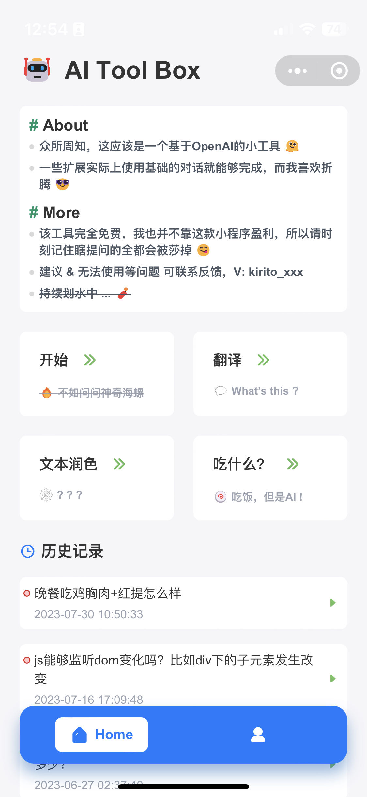
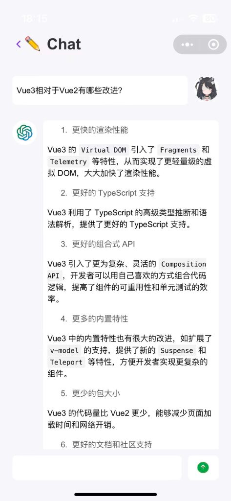
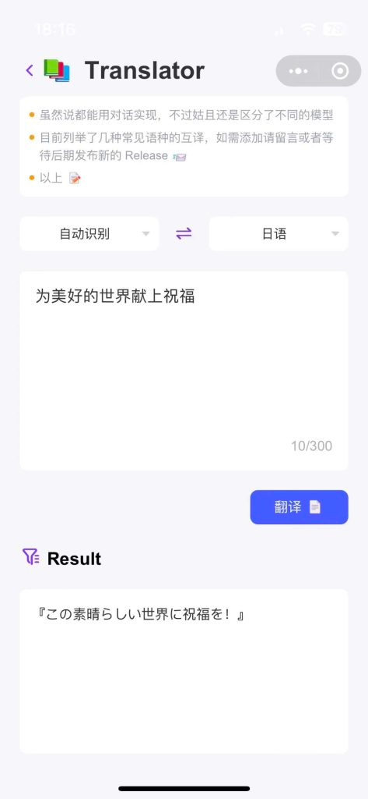
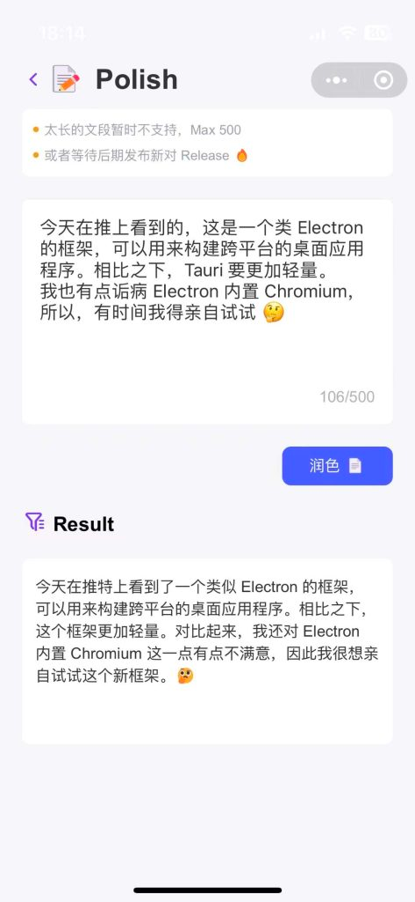
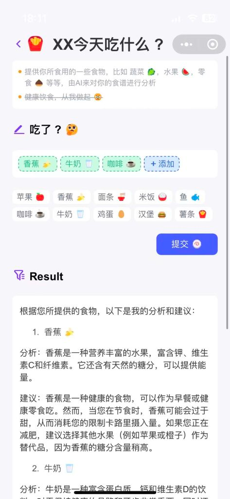

# AI_TOOL_BOX Service

这是一个基于OpenAI的微信小程序，用于提供一些AI相关的服务。

- 与AI交流（聊天机器人）
- 翻译 (多种语言的互译)
- 文本润色 (语法检查及修复)
- 饮食分析 (根据给出的食物，分析食物的热量及营养成分)

## 项目结构

### 后端

- Java11
- SpringBoot
- Mybatis Plus
- MySQL
- Redis
- ...

### 前端

- Vue2
- uni-app
- uView
- ...

## 预览

    
    
    
    
    

